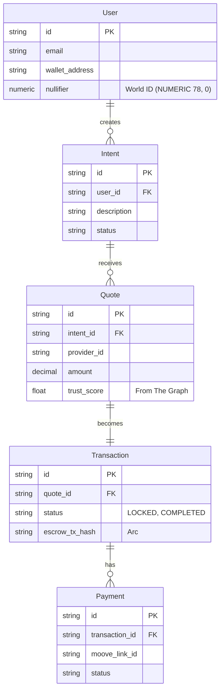
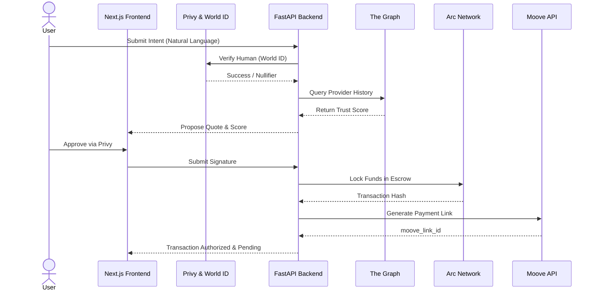

# Intentra System Architecture & Developer Guide

This document is the complete blueprint for the Intentra system. It is designed to be shared with other developers to understand the architecture, service boundaries, third-party integrations, and agent capabilities.

## 1. High-Level Architecture & Communication

Intentra is built as a **Modular Monolith** using **Python (FastAPI)** for the backend and **Next.js** for the frontend. 

### 1. Backend (FastAPI / Python)
*   **Architecture Pattern:** Modular Monolith utilizing **Clean Architecture (Hexagonal/Ports & Adapters)**. We will strictly separate concerns into three tiers:
    1.  **Entrypoints/Adapters:** FastAPI routers and background task listeners.
    2.  **Use Cases/Services:** Pure business logic (e.g., `PaymentService`, `TrustService`) completely decoupled from the framework.
    3.  **Domain/Entities:** Plain Python objects and `SQLModel` definitions with zero external dependencies.
*   **API Framework:** FastAPI running on Gunicorn with Uvicorn worker processes to maximize CPU utilization for I/O bound operations.
*   **Database ORM:** We will use async `SQLModel` (built on SQLAlchemy) and `asyncpg` to prevent synchronous blocking.
*   **Background Jobs:** Celery with Redis as the message broker. Any heavy operations (Moove polling, Bazantic syncs) will be offloaded instantly to worker processes to keep the HTTP request-response cycle fast.

### Database Schema (ERD)

### How Services Communicate
Because it is a modular monolith, all backend services live in the same repository and run in the same process. 
*   **Synchronous Communication**: Services communicate via **Dependency Injection** (direct Python function calls). For example, the `IntentService` directly calls the `TransactionService.create()` method, passing strongly-typed Pydantic models. This avoids network latency and ensures transactional consistency.
*   **Asynchronous Communication**: For long-running tasks (e.g., calling OpenAI to negotiate a quote, or waiting for a Moove payment webhook), services drop jobs into **Celery/Redis**. A background worker picks up the job, executes it, and updates the database.

### System Flow & Communication

## 2. Service Breakdown: What Each Service Does

Here is the breakdown of the FastAPI backend modules:

*   **`IntentService`**: The entry point for the user. It parses natural language (e.g., "I need a painter in Lagos for max ₦250,000") into a structured JSON `Intent` object using an LLM. 
*   **`AgentService`**: The internal AI logic. It takes the structured `Intent`, queries the database for matching providers, scores them, and generates a recommended `Quote`.
*   **`AuthorizationService`**: The strict policy engine. It ensures that an AI agent never executes a transaction without explicit human approval or a pre-configured policy. It verifies cryptographic signatures and auth tokens (from Privy).
*   **`TransactionService`**: The core state machine. It manages the lifecycle: `CREATED` -> `AUTHORIZED` -> `PAYMENT_PENDING` -> `FULFILLING` -> `EVIDENCE_SUBMITTED` -> `RESOLVED`.
*   **`PaymentService` (The Adapter)**: Handles moving money. It looks at the `currency` of the transaction and routes it to the correct adapter (Moove for fiat, Arc for crypto).
*   **`Evidence & Fulfillment Service`**: Manages the upload of photos, receipts, or on-chain data proving the job was completed.
*   **`TrustService`**: Calculates a provider's reputation score based on past successful transactions and on-chain history.
*   **`AgentGatewayService`**: The public-facing API for *external* agents (via Bazantic) to interact with Intentra.

## 3. Third-Party Integrations & Python Compatibility

Here is exactly where each partner fits into the architecture, and how easily they integrate with our Python/FastAPI backend:

| Partner | Where it is Included | Python SDK Compatibility |
| :--- | :--- | :--- |
| **Privy** | **Frontend**: Handles login UI and embedded wallets. **Backend (`AuthorizationService`)**: Verifies the JWT tokens on API requests. | **Excellent**. Privy provides an official server-side Python SDK. We will use it to verify tokens securely and manage user data/embedded wallets from the backend. |

| **World ID** | **Frontend**: Widget for users to prove humanness. **Backend (`IdentityService`)**: Verifies the zero-knowledge proof before onboarding or high-risk actions. | **Excellent**. World ID uses standard REST APIs to verify the cryptographic proofs. Easy to call via Python's `httpx` or `requests`. |
| **The Graph** | **Backend (`TrustService` & `EvidenceService`)**: Queries decentralized subgraphs to fetch a provider's historical on-chain fulfillment records. | **Excellent**. The Graph uses standard GraphQL. We can query it easily using Python's `gql` or standard `httpx` POST requests. |
| **Moove** | **Backend (`PaymentService`)**: Generates fiat payment links and listens for webhooks when the user pays the Lagos painter in Naira. | **Excellent**. Moove operates via standard REST APIs and Webhooks. |
| **Arc** | **Backend (`PaymentService`)**: Executes USDC transfers if the transaction is crypto-native. | **Excellent**. We will use the officially recognized `web3.py` directly within our FastAPI backend to execute raw cryptographic transactions. |
| **Bazantic** | **Backend (`AgentGatewayService`)**: Exposes our API endpoints as an MCP (Model Context Protocol) server so external agents can use our platform. | **Excellent**. Bazantic wraps our existing REST endpoints. |

## 4. What Can the Agents Do?

In Intentra, the AI is a **facilitator**, not an autocratic decision-maker.

**Internal Agents (Built by us):**
1.  **Understand Intent**: Translate messy human requests into strict constraints (Budget: $200, Location: Lagos, Deadline: Friday).
2.  **Discover & Recommend**: Search the provider database, analyze trust scores (from The Graph), and recommend the top 3 options to the user.
3.  **Negotiate**: The agent can interact with providers to negotiate a final price, *but only within the user's pre-approved budget*.
4.  **Propose Transaction**: The agent drafts the final `Quote` and pauses. It **cannot** move money. It must request Authorization from the human (via Privy).

**External Agents (Built by others via Bazantic):**
1.  An external AI (like a company's procurement bot) can hit our `AgentGatewayService`.
2.  It can query our provider catalog and request quotes.
3.  If it wants to hire someone, it submits the intent to Intentra. Intentra still forces the human owner of that external agent to approve the transaction via our `AuthorizationService`.

---

## Open Questions

> [!WARNING]
> Please provide feedback before we initialize the project:
> 1. Does this documentation provide the clarity you need to share with the rest of the development team? Are we ready to begin setting up the repository?

## User Review Required

> [!IMPORTANT]
> Please review this final System Architecture Document. If you approve, I will begin executing the initial project setup!
